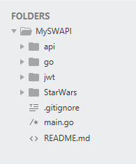
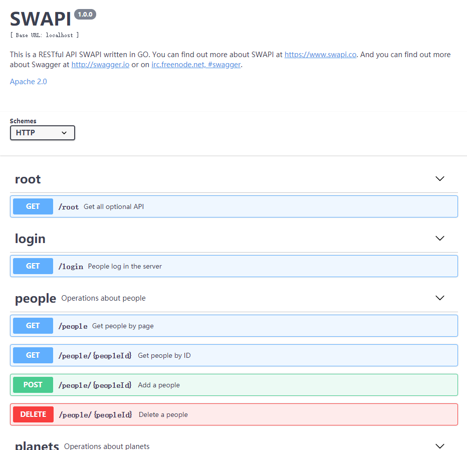
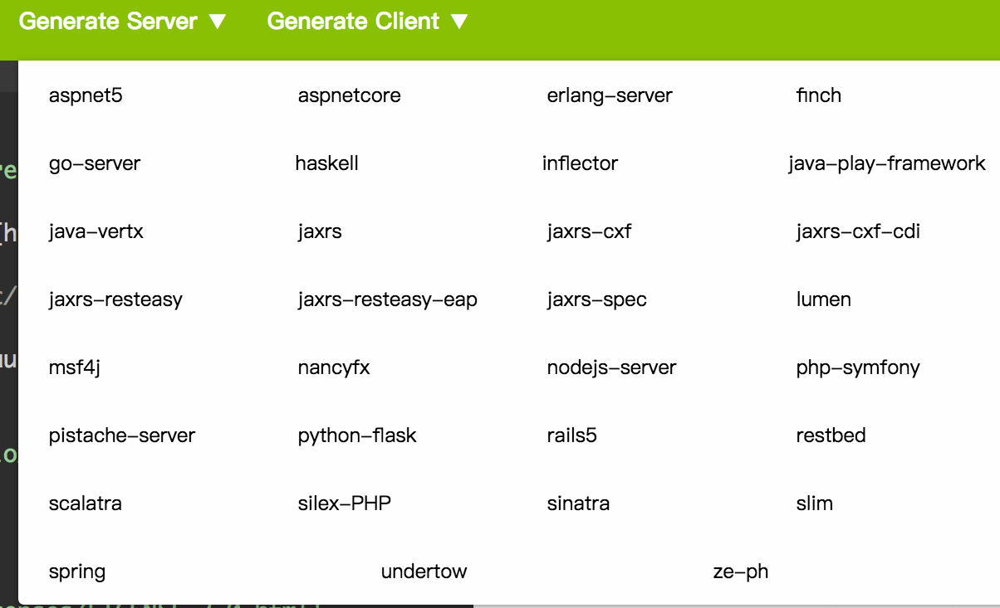

# SWAPI 设计
本次项目的内容是使用 GO 实现一个 [SWAPI](https://swapi.co/) 服务器端程序。
## 项目结构


其中：
- main.go 为程序入口
- go/ 为路由和 API 的实现
- jwt/ 为 JWT 验证功能的实现
- StarWars/ 为数据库部分
- api/ 为API设计文档
## 1. Swagger 的使用
Swagger 是一个 RESTful APIs 文档生成工具，文档中提供的方法，使我们可以用指定的 json 或者 yaml 摘要来描述您的 API，并自动生成代码框架。
### 1.1 安装与运行
* 您可以在官网上[在线编辑](http://editor.swagger.io/#/)
* 也可以按照以下方式在本地部署
1. 下载并且安装 node.js
2. npm install -g http-server 
3. 下载项目 https://github.com/swagger-api/swagger-editor 并且解压。 
4. 进入swagger-editor文件夹。运行http-server命令。 
5. 进入http://localhost 就可以看到swagger页面了。

### 1.2 开始编写文档
关于 yaml 语法的细节可以参考[这篇教程](http://www.ruanyifeng.com/blog/2016/07/yaml.html)  
下面是一个基本的 swagger 文档的组成部分以及注释：
```yaml
swagger: '2.0'                      # swagger的版本
info:
  title: 文档标题
  description:  描述
  version: "v1.0"                   # 版本号
  termsOfService: ""                # 文档支持截止日期
  contact:                          # 联系人的信息
    name: ""                        # 联系人姓名
    url: ""                         # 联系人URL
    email: ""                       # 联系人邮箱
  license:                          # 授权信息
    name: ""                        # 授权名称，例如Apache 2.0
    url: ""                         # 授权URL
host: api.haofly.net                # 域名，可以包含端口，如果不提供host，那么默认为提供yaml文件的host
basePath: /                         # 前缀，比如/v1
schemes:                            # 传输协议
  - http
  - https

securityDefinitions:                # 安全设置
  api_key:
    type: apiKey
    name: Authorization             # 实际的变量名比如，Authorization
    in: header                      # 认证变量放在哪里，query或者header
  OauthSecurity:                    # oauth2的话有些参数必须写全
    type: oauth2
    flow: accessCode                # 可选值为implicit/password/application/accessCode
    authorizationUrl: 'https://oauth.simple.api/authorization'
    tokenUrl: 'https://oauth.simple.api/token'
    scopes:
      admin: Admin scope
      user: User scope
      media: Media scope
  auth:
    type: oauth2
    description: ""                 # 描述
    authorizationUrl: http://haofly.net/api/oauth/
    name: Authorization             # 实际的变量名比如，Authorization
    tokenUrl:
    flow: implicit                  # oauth2认证的几种形式，implicit/password/application/accessCode
    scopes:
      write:post: 修改文件
      read:post: 读取文章

security:                           # 全局的安全设置的一个选择吧
  auth:
    - write:pets
    - read:pets

consumes:                           # 接收的MIME types列表
  - application/json                # 接收响应的Content-Type
  - application/vnd.github.v3+json

produces:                           # 请求的MIME types列表
  - application/vnd.knight.v1+json  # 请求头的Accept值
  - text/plain; charset=utf-8
tags:                               # 相当于一个分类
  - name: post  
    description: 关于post的接口

externalDocs:
  description: find more info here
  url: https://haofly.net

paths:                              # 定义接口的url的详细信息
  /projects/{projectName}:          # 接口后缀，可以定义参数
    get:
      tags:                         # 所属分类的列表
        - post  
      summary: 接口描述              # 简介
      description:                  # 详细介绍
      externalDocs:                 # 这里也可以加这个
        description:
        url:
      operationId: ""               # 操作的唯一ID
      consumes: [string]            # 可接收的mime type列表
      produces: [string]            # 可发送的mime type列表
      schemes: [string]             # 可接收的协议列表
      deprecated: false             # 该接口是否已经弃用
      security:                     # OAuth2认证用
        - auth: 
            - write:post
            - read: read
      parameters:                   # 接口的参数
        - name: projectName         # 参数名
          in: path                  # 该参数应该在哪个地方，例如path、body、query等，但是需要注意的是如果in body，只能用schema来指向一个定义好的object，而不能直接在这里定义
          type: string              # 参数类型
          allowEmptyValue: boolean          # 是否允许为空值
          description: 项目名        # 参数描述
          required: true            # 是否必须
          default: *                # 设置默认值
          maximum: number           # number的最大值
          exclusiveMaximum: boolean # 是否排除最大的那个值
          minimum: number           # number的最小值
          exclusiveMinimum: boolean
          maxLength: integer        # int的最大值
          minLength: integer
          enum: [*]                 # 枚举值
          items:                    # type为数组的时候可以定义其项目的类型
        - $ref: "#/parameters/uuidParam"   # 这样可以直接用定义好的
      responses:                    # 设置响应
        200:                        # 通过http状态来描述响应
          description: Success      # 该响应的描述
          schema:                   # 定义返回数据的结构
            $ref: '#/definitions/ProjectDataResponse'  # 直接关联至某个model

  /another: # 另一个接口
      responses:
        200:
            description:
            schema:
              type: object
              properitis:
                data:
                    $ref: '#/definitions/User' # 关联

definitions:            # Model/Response的定义，这里的定义不强制要求返回数据必须和这个一致，但是在swagger-ui上，会展示这里面的字段。
  Product:              # 定义一个model
    type: object        # model类型
    properties:         # 字段列表
      product_id:       # 字段名
        type: integer   # 字段类型
        description:    # 字段描述
      product_name:
        type: string
        description: 
  ProjectDataResponse:
    type: object
    properties:
        data:
            $ref: '#/definitions/ProjectResponse'  # model之间的关联，表示在data字段里面包含的是一个ProjectResponse对象
parameters:             # 可以供很多接口使用的params
  limitParam:
    name: limit
    in: query
    description: max records to return
    required: true
    type: integer
    format: int32
responses:              # 可以供很多接口使用的responses
  NotFound:
    description: Entity not found.
```

### 1.3 生成 API 代码框架
编写完成 API 文档后，即可实时的预览生成的API：



点击上方工具栏的 Generate Server，选择相应语言，即可生成服务端代码：



## 2. API 的实现
### 2.1 一个基本的 Web Server

一个RESTful服务本质上首先是一个Web Server。NewRouter负责构建这样一个 Web 服务：
```go
 func main() {
   log.Printf("Server started")
 
   router := sw.NewRouter()
 
   log.Fatal(http.ListenAndServe(":8080", router))
 }
```

### 2.2 增加服务器的路由
1. 首先需要安装包```github.com/gorilla/mux```：
```
go get github.com/gorilla/mux
```

2. Router 的实现

路由信息是存放在一个 Route 类型的数组（[]Route）中，数组中的每一个 Route 对象都表示一条路由信息，其中包含匹配该路由应该满足的所有条件及对应的上层处理 Hanlder。当请求到来是 Router 会遍历 Route 数组，找到第一个匹配的路由则执行对应的处理函数，如果找不到则执行 NotFoundHandler。

```go
type Route struct {
  Name        string
  Method      string
  Pattern     string
  HandlerFunc http.HandlerFunc
}

type Routes []Route

func NewRouter() *mux.Router {
  router := mux.NewRouter().StrictSlash(true)
  for _, route := range routes {
    var handler http.Handler
    handler = route.HandlerFunc
    handler = Logger(handler, route.Name)

    router.
      Methods(route.Method).Path(route.Pattern).
      Name(route.Name).
      Handler(handler)
  }

  return router
}
```

> 与 http.ServerMux 不同的是 mux.Router 是完全的正则匹配

> 设置路由路径 /index/，如果访问路径 /idenx/hello 会返回404

> 设置路由路径为 /index/，访问路径 /index也是会报404的,需要设置 r.StrictSlash(true)， /index/ 与 /index 才能匹配

### 2.3 JWT 身份验证
#### 基于 Token 的身份验证方法：
- 客户端使用用户名跟密码请求登录
- 服务端收到请求，去验证用户名与密码
- 验证成功后，服务端会签发一个 Token，再把这个 Token 发送给客户端
- 客户端收到 Token 以后可以把它存储起来，比如放在 Cookie 里或者 Local Storage 里
- 客户端每次向服务端请求资源的时候需要带着服务端签发的 Token
- 服务端收到请求，然后去验证客户端请求里面带着的 Token，如果验证成功，就向客户端返回请求的数据

具体过程参照[基于 Token 的身份验证：JSON Web Token](https://ninghao.net/blog/2834)，提供了JSON Web Token 的签发与验证方法。

#### 下面以 go 来实现：

使用了```github.com/dgrijalva/jwt-go```：
```go
go get github.com/dgrijalva/jwt-go
```
对于 JWT 标准的 Token 三个部分，
- header（头部）
- payload（数据）
- signature（签名）

签发过程如下：
```go
/*
 * Generate Token with name
 */
func GenerateToken(name string) string {
    // create header
    token := jwt.New(jwt.SigningMethodHS256)
    claims := make(jwt.MapClaims)

    // add payload
    claims["iss"] = "CloudCompute711"
    claims["sub"] = "SWAPI"
    claims["exp"] = time.Now().Add(time.Hour * time.Duration(1)).Unix()
    claims["iat"] = time.Now().Unix()
    token.Claims = claims

    // create signature
    tokenString, _ := token.SignedString([]byte(name))
    return tokenString
}

/*
 * Valid Token with name
 */
func ValidToken(tokenString string, name string) bool {
    token, err := jwt.Parse(tokenString, func(token *jwt.Token) (interface{}, error) {
        if _, ok := token.Method.(*jwt.SigningMethodHMAC); !ok {
            return nil, fmt.Errorf("Unexpected signing method: %v", token.Header["alg"])
        }
        return []byte(name), nil
    })
    if token.Valid {
        return true
    } else {
        fmt.Println(err)
        return false
    }
}
```
当用户登录时，服务器端要做：
- 从 http 请求的 body 中读取数据
- 数据转换成 json，获得请求登陆的用户
- 验证是否存在用户
- 签发 token，并返回给用户

```go
func Login(w http.ResponseWriter, r *http.Request) {
  myDb, err := db.StartDB("mydb.db")
  if err != nil {
    fmt.Printf("Fail in open database: %v\n", err)
    return
  }

  // Read data from http request body
  body, err := ioutil.ReadAll(r.Body)
    if err != nil {
    fmt.Printf("Read body error: %v\n", err)
        return
  }

  // Unmarshal to json
  var info LoginInfo
  if err = json.Unmarshal(body, &info); err != nil {
        fmt.Printf("Unmarshal err, %v\n", err)
        return
    }
  
  // Whether the people exists
  if !myDb.HasObj("people", []byte(info.name)) {
    fmt.Printf("People dose not exist\n")
        return
  }

  // Generate token by name
  token := jwt.GenerateToken(info.name)

  myDb.LogIn([]byte(info.name), []byte(token))

  w.Header().Set("Content-Type", "application/json; charset=UTF-8")
  w.WriteHeader(http.StatusOK)
  w.Write([]byte(token))
}
```
### 2.4 API 实现
当客户机请求 API 时，服务器端要做：
- 验证请求中是否存在 token 以及 token 是否有效
- 调用数据库，执行相应操作（GET、POST、DELETE）
- 返回 response 信息

#### root/
API root 能获取服务列表：
```go
func GetAllAPI(w http.ResponseWriter, r *http.Request) {
    url := "http://localhost:8080" 
  w.Header().Set("Content-Type", "application/json; charset=UTF-8")
  w.WriteHeader(http.StatusOK)
    var root = Root{url + "/people/",
                    url + "/planets/",
                    url + "/species/",
                    url + "/vehicles/",
                    url + "/films/",
                    url + "/starships/"}
    data, _ := json.Marshal(root)
    w.Write([]byte(data))
}
```

#### people/{peopleId}
以根据 ID 请求 people 信息的 GET 方法为例：
```go
/*
 * Get people by ID
 * return:
 *   200: Successful operation
 *   401: Unauthorized
 *   404: Invalid ID supplied
 */
func GetPeopleById(w http.ResponseWriter, r *http.Request) {
  myDb, err := db.StartDB("mydb.db")
  if err != nil {
    fmt.Printf("Fail in open database: %v\n", err)
    return
  }

  // Verify token
  token := r.Header.Get("AuthToken")
  if (!myDb.IsLogIn([]byte(token))) {
    fmt.Printf("Unauthorized: %v\n", err)
    // 401: Unauthorized
    w.WriteHeader(http.StatusUnauthorized)
    return
  }

  // Get people by ID
  vars := mux.Vars(r)
  peopleId, err := strconv.Atoi(vars["peopleId"])

  data := myDb.SearchByID("people", []byte(strconv.Itoa(peopleId)))
  if data != nil {
    fmt.Printf("Read body error: %v\n", err)
    w.WriteHeader(http.StatusNotFound)
  }

  w.Header().Set("Content-Type", "application/json; charset=UTF-8")
  w.WriteHeader(http.StatusOK)

  // Write information to response
  w.Write(data)
}
```